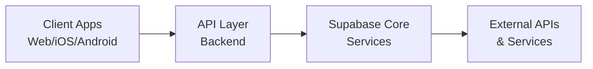
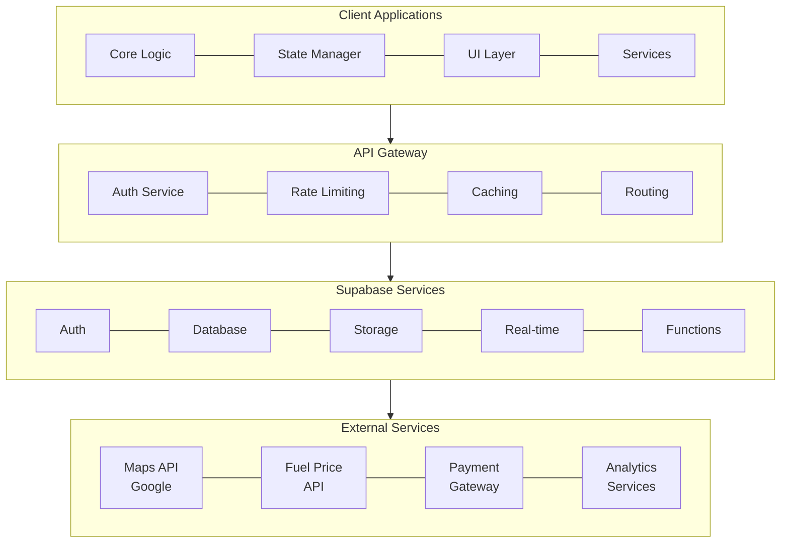
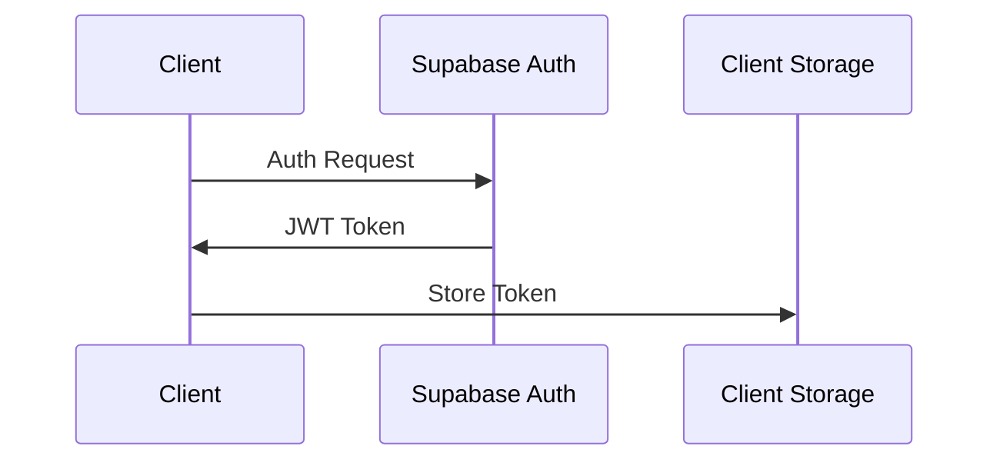
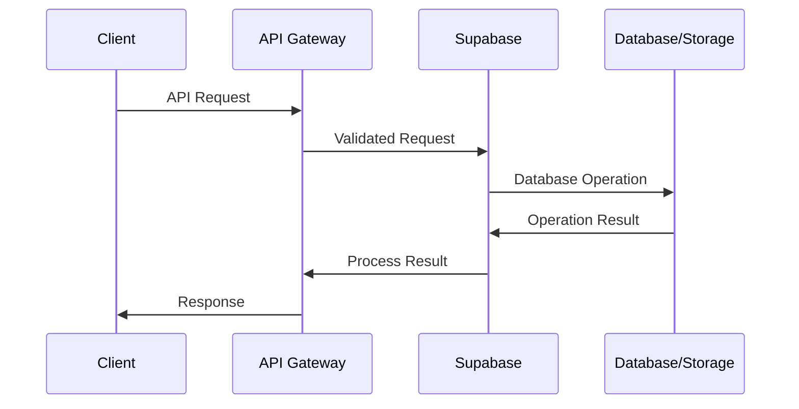
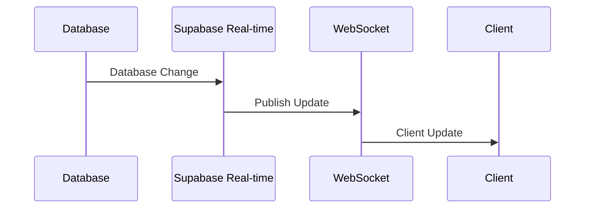

# FuelCare - Vehicle Manager Application PRD

## Overview
FuelCare is a comprehensive vehicle management application designed to help users track and optimize their vehicle-related expenses, maintenance, and fuel consumption. The application provides real-time information about nearby gas stations, fuel prices, and offers detailed analytical insights for better financial decision-making.

## Product Goals
- Provide users with a comprehensive tool for managing vehicle expenses
- Help users find the best fuel prices and nearby gas stations
- Enable efficient maintenance scheduling and tracking
- Deliver actionable insights through data analysis
- Create a seamless cross-platform experience

## Target Platforms
- Web Application (Progressive Web App)
- iOS Application
- Android Application

## Core Features

### 1. Fuel Cost Tracking
- Log fuel purchases with details:
  - Date and time
  - Fuel type
  - Price per unit
  - Total cost
  - Odometer reading
  - Gas station location
- View fuel consumption statistics
- Track fuel efficiency

### 2. Vehicle Expense Management
- Categories for different expense types:
  - Maintenance
  - Insurance
  - Registration
  - Repairs
  - Parking
  - Tolls
- Attach receipts and documents
- Generate expense reports
- Set budget alerts

### 3. Gas Station Finder
- Real-time location-based search
- Filter by:
  - Fuel type
  - Price
  - Distance
  - Available services
- Save favorite stations
- User ratings and reviews

### 4. Fuel Price Comparison
- Real-time price updates
- Historical price trends
- Price predictions
- Price alerts for favorite stations
- Filter by fuel type

### 5. Cost Analysis
- Monthly/yearly expense breakdown
- Cost per kilometer/mile analysis
- Fuel efficiency trends
- Maintenance cost analysis
- Budget tracking and forecasting
- Custom report generation

### 6. Maintenance Management
- Maintenance schedule tracking
- Service reminders
- Maintenance history
- Service provider directory
- Maintenance checklists
- Document storage for service records

## Technical Architecture

### System Design

#### High-Level Architecture


#### Component Architecture


#### Data Flow

1. **Authentication Flow**


2. **Data Operations Flow**


3. **Real-time Updates Flow**


#### Security Measures

1. **Authentication & Authorization**
   - JWT-based authentication
   - Role-based access control
   - Row Level Security in database
   - API key management

2. **Data Security**
   - End-to-end encryption
   - Secure data storage
   - HTTPS/SSL
   - Input validation
   - SQL injection prevention

3. **API Security**
   - Rate limiting
   - Request validation
   - CORS policies
   - API versioning

#### Scalability Considerations

1. **Horizontal Scaling**
   - Stateless API design
   - Load balancing
   - Database replication
   - Caching strategies

2. **Performance Optimization**
   - CDN integration
   - Response compression
   - Query optimization
   - Batch operations

3. **Monitoring & Maintenance**
   - Performance monitoring
   - Error tracking
   - Usage analytics
   - Automated backups

### Technology Stack

#### Web Application (PWA)

**Frontend Technologies**
- React 18
- Next.js 14
- TailwindCSS
- Redux Toolkit with RTK Query
- React Hook Form with Zod validation

**Development Tools**
- TypeScript 5
- ESLint
- Prettier
- Jest
- React Testing Library
- Cypress for E2E testing

**Build Tools**
- Vite
- SWC
- Workbox for PWA
- Bundle Analyzer

#### iOS Application

**Core Technologies**
- Swift 5.9
- SwiftUI
- Combine
- Swift Concurrency (async/await)

**State Management**
- The Composable Architecture (TCA)
- TCA Dependencies

**Development Tools**
- Xcode 15
- Swift Package Manager
- SwiftLint
- SwiftFormat

**Testing Tools**
- XCTest
- Quick
- Nimble
- SnapshotTesting

#### Android Application

**Core Technologies**
- Kotlin 1.9
- Jetpack Compose
- Material Design 3
- Compose Navigation

**Architecture Components**
- ViewModel
- Koin
- Room Database
- DataStore

**Development Tools**
- Android Studio
- Gradle 8
- KtLint
- Detekt

**Testing Tools**
- JUnit 5
- Mockk
- Espresso
- Compose Testing

### Frontend Architecture
Each platform implementation will follow Clean Architecture principles with a feature-first structure:

```
platform/
├── core/
│   ├── utils/
│   ├── theme/
│   └── config/
├── components/
│   ├── buttons/
│   ├── inputs/
│   ├── cards/
│   ├── layouts/
│   ├── navigation/
│   └── feedback/
├── vehicle/
│   ├── domain/
│   │   ├── entities/
│   │   ├── repositories/
│   │   └── usecases/
│   ├── data/
│   │   ├── models/
│   │   ├── repositories/
│   │   └── datasources/
│   └── presentation/
├── fuel/
│   ├── domain/
│   │   ├── entities/
│   │   ├── repositories/
│   │   └── usecases/
│   ├── data/
│   │   ├── models/
│   │   ├── repositories/
│   │   └── datasources/
│   └── presentation/
├── expense/
│   ├── domain/
│   │   ├── entities/
│   │   ├── repositories/
│   │   └── usecases/
│   ├── data/
│   │   ├── models/
│   │   ├── repositories/
│   │   └── datasources/
│   └── presentation/
├── maintenance/
│   ├── domain/
│   │   ├── entities/
│   │   ├── repositories/
│   │   └── usecases/
│   ├── data/
│   │   ├── models/
│   │   ├── repositories/
│   │   └── datasources/
│   └── presentation/
└── station/
    ├── domain/
    │   ├── entities/
    │   ├── repositories/
    │   └── usecases/
    ├── data/
    │   ├── models/
    │   ├── repositories/
    │   └── datasources/
    └── presentation/
```

### Backend Architecture (Supabase)
- Authentication and Authorization
- Real-time Database
- Storage for vehicle documents and receipts
- REST API endpoints
- Database migrations

## Database Schema

### Migrations
- Located in `/database/migrations/`
- Timestamp-based versioning (YYYYMMDDHHMMSS_description.sql)
- Each entity change requires a new migration
- No updates to existing migrations

### Core Tables

```sql
-- Users
users
  - id
  - email
  - name
  - preferences

-- Vehicles
vehicles
  - id
  - user_id
  - make
  - model
  - year
  - license_plate
  - vin

-- Fuel Logs
fuel_logs
  - id
  - vehicle_id
  - date
  - fuel_type
  - quantity
  - price_per_unit
  - total_cost
  - odometer
  - gas_station_id
  - notes

-- Expenses
expenses
  - id
  - vehicle_id
  - category
  - amount
  - date
  - description
  - receipt_url

-- Maintenance Records
maintenance_records
  - id
  - vehicle_id
  - service_type
  - date
  - odometer
  - cost
  - provider
  - notes
  - documents_url

-- Gas Stations
gas_stations
  - id
  - name
  - location
  - address
  - services
  - rating

-- Fuel Prices
fuel_prices
  - id
  - gas_station_id
  - fuel_type
  - price
  - last_updated
```

## API Documentation
- OpenAPI/Swagger documentation
- Located in `/api/swagger/`
- Separate documentation for each major version
- Includes authentication requirements
- Request/response examples
- Error codes and handling

## Security Requirements
- Secure user authentication
- Data encryption at rest and in transit
- Regular security audits
- GDPR compliance
- Secure file storage
- API rate limiting

## Performance Requirements
- App launch time < 3 seconds
- API response time < 500ms
- Offline functionality for core features
- Efficient data synchronization
- Battery usage optimization
- Minimal data usage

## Future Considerations
- Integration with vehicle OBD devices
- Social features for sharing tips
- Gamification elements
- Electric vehicle support
- Fleet management features
- Integration with payment systems

## Development Workflow
1. Feature branch development
2. Code review requirements
3. Testing requirements
4. CI/CD pipeline
5. Documentation updates
6. Migration management

## Project Structure
```
fuelcare/
├── webapp/
│   └── [Clean Architecture Structure]
├── ios/
│   └── [Clean Architecture Structure]
├── android/
│   └── [Clean Architecture Structure]
├── database/
│   └── migrations/
├── api/
│   └── swagger/
└── docs/
    └── technical/
```

## Development Roadmap

### Phase 1: Foundation (Months 1-2)
- Project setup and architecture implementation
- Basic user authentication and profile management
- Vehicle management (CRUD operations)
- Initial database schema implementation
- Basic UI components and navigation

### Phase 2: Core Features (Months 3-4)
- Fuel logging and tracking
- Basic expense management
- Simple maintenance tracking
- Offline data persistence
- Basic analytics and reporting

### Phase 3: Location Services (Months 5-6)
- Gas station finder implementation
- Real-time price updates
- Maps integration
- Geolocation services
- Station ratings and reviews

### Phase 4: Advanced Features (Months 7-8)
- Advanced analytics and insights
- Maintenance scheduling and reminders
- Document management system
- Budget tracking and alerts
- Performance optimizations

### Phase 5: Platform Specific Features (Months 9-10)
- iOS-specific features and optimizations
- Android-specific features and optimizations
- PWA optimizations
- Platform-specific UI/UX improvements
- Widget/extension support

### Phase 6: Enhancement and Polish (Months 11-12)
- Advanced data synchronization
- Performance optimization
- UI/UX refinements
- Security hardening
- Beta testing and feedback implementation

### Future Phases
- OBD integration
- Social features
- Gamification
- Fleet management
- Payment integration
- Electric vehicle support
