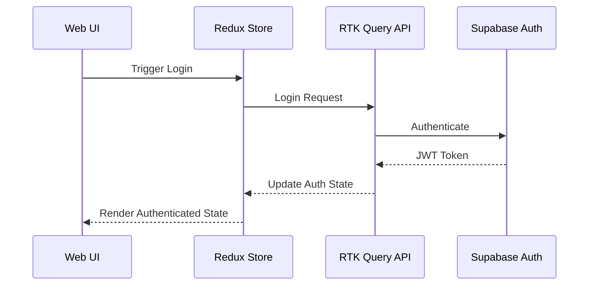

# RFC 1002: Web Authentication and User Management

## Status
- Status: Draft
- Date: 2024-01-20
- Priority: P0 (Foundational)

## Context
A secure and scalable authentication system is crucial for the FuelCare web application, providing user access management and personalized experiences.

## Goals
- Implement secure web authentication flow
- Create responsive user profile management UI
- Handle client-side session management
- Implement role-based access control in the web interface

## Detailed Design

### Web Authentication Flow


### React Components Structure
```
webapp/
├── features/
│   └── auth/
│       ├── components/
│       │   ├── LoginForm
│       │   ├── RegisterForm
│       │   ├── PasswordReset
│       │   └── ProfileSettings
│       ├── hooks/
│       │   ├── useAuth
│       │   └── useProfile
│       ├── store/
│       │   ├── authSlice
│       │   └── authApi
│       └── utils/
│           ├── validation
│           └── security
```

### State Management
```typescript
interface AuthState {
  user: User | null;
  token: string | null;
  isAuthenticated: boolean;
  loading: boolean;
  error: string | null;
}

interface User {
  id: string;
  email: string;
  fullName: string;
  preferences: UserPreferences;
  role: UserRole;
}
```

### Features
1. Authentication UI
   - Login page with form validation
   - Registration flow with email verification
   - Password reset interface
   - Social auth buttons (Google, GitHub)

2. User Profile UI
   - Profile settings page
   - Preferences management interface
   - Avatar upload component
   - Notification settings panel

3. Session Management
   - Persistent session with Redux
   - Token refresh mechanism
   - Auto-logout functionality
   - Multi-tab synchronization

4. Access Control UI
   - Role-based route protection
   - Feature-based UI rendering
   - Permission-based actions
   - Admin interface access

## Implementation Plan

### Phase 1: Core Authentication UI (Week 1)
- [ ] Set up auth feature structure
- [ ] Implement login/register forms
- [ ] Add form validation with Zod
- [ ] Create auth API slice with RTK Query

### Phase 2: Profile Management UI (Week 2)
- [ ] Build profile settings page
- [ ] Create preference management components
- [ ] Implement avatar handling
- [ ] Add settings persistence

### Phase 3: Security Features (Week 3)
- [ ] Add protected route components
- [ ] Add session management
- [ ] Create security utility hooks

### Phase 4: Testing & Polish (Week 4)
- [ ] Component testing
- [ ] Integration testing
- [ ] E2E auth flow testing
- [ ] UI/UX refinements

## Component Specifications

### LoginForm Component
```typescript
interface LoginFormProps {
  onSuccess?: () => void;
  onError?: (error: Error) => void;
  redirectPath?: string;
}

const validationSchema = z.object({
  email: z.string().email(),
  password: z.string().min(8),
});
```

### Protected Route Component
```typescript
interface ProtectedRouteProps {
  children: React.ReactNode;
  requiredRole?: UserRole;
  fallback?: React.ReactNode;
}
```

## Security Considerations
- Client-side token storage strategy
- XSS prevention in forms
- CSRF protection
- Input sanitization
- Rate limiting UI feedback
- Secure password handling

## Testing Strategy
- Unit tests for auth hooks
- Component tests for forms
- Integration tests for auth flow
- E2E tests for critical paths
- Accessibility testing for forms

## Error Handling
- Form validation feedback
- API error messages
- Session timeout handling
- Network error recovery
- Validation error display

## Performance Considerations
- Lazy loading auth components
- Optimistic UI updates
- Token refresh strategy
- Form submission debouncing
- State rehydration

## Open Questions
1. Social auth provider preferences?
2. Password complexity requirements?
3. Session timeout duration?
4. Required accessibility standards? 